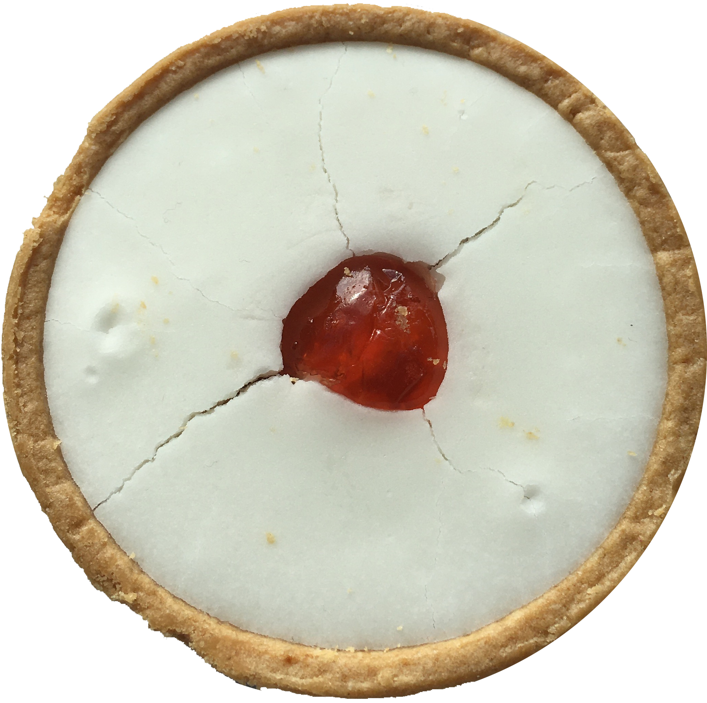

.. Capabilities for Coders documentation master file, created by
   sphinx-quickstart on Fri Jul  8 15:30:14 2022.
   You can adapt this file completely to your liking, but it should at least
   contain the root `toctree` directive.

======================================
Capabilities for Coders
======================================

.. toctree::
   :maxdepth: 2
   :caption: Contents:

   about
   faq/index

Search docs
==================

* :ref:`search`
